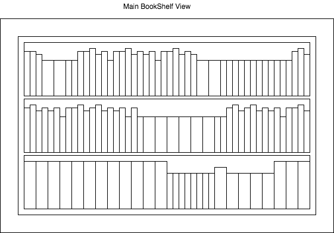
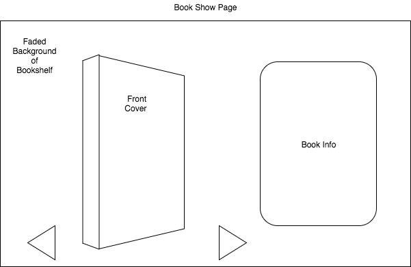
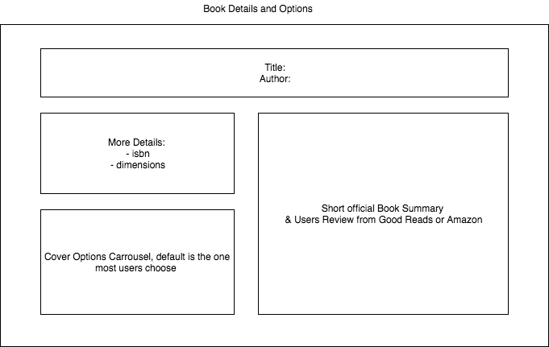
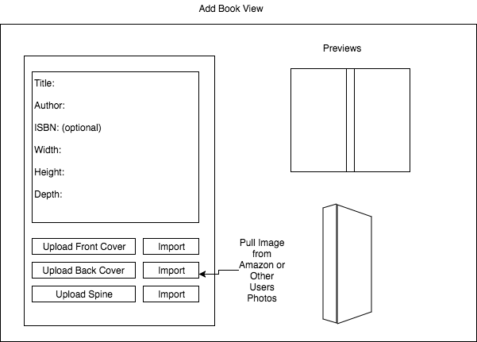

#VirtualBookshelf

## Background

Building off my Javascript project that animated a handful of preselected
books this project will build out that seed idea into the full vision. The full scale app
will enable users to curate and display their own virtual bookshelf collections
via mobil, desktop, or home tv.

There are several book review and library management sites, GoodReads being
a primary example, however none of the available sites offer a way to virtually
recreate the bookshelf experience.

### MVP  

- [ ] have Users
- [ ] Users have books
- [ ] Pull a users read books via good reads api
- [ ] Users can add their own photos
- [ ] fully enable touch screen interaction
- [ ] Users can select a book off the shelf and display book data
- [ ] Browse through books on the shelf the same way one would physically.
 Books are displayed by spine, not front cover, and as a user browses over
  them (mousing over, or swiping on touch screen) books are animated to allow
   the user to peak at the front and back covers.

### Bonus features

- [ ] Pull cover art with the amazon api
- [ ] Users can use others photos
- [ ] selected book can be opened in connected apps like kindle
- [ ] get on app store

### Wireframes

### Work done over the weekend

- Start react native tutorials
- research  

### Architecture and Technologies

This project will be implemented with the following technologies:

- rails back end
- React Native
- Good Reads API
  - auth.user — Get id of user who authorized OAuth.
  - reviews.list — Get the books on a members shelf.
    - includes image urls, but not images themselves
- Amazon API
  - item.search
  - itemlookup.images
  - itemlookup.ItemDimensions

### Timeline

**Day 1 Monday, 7/7 **:
- [x] get GoodReads api key
- [ ] get Amazon api key
- [ ] finalize schedule
- [ ] complete React Native tutorials

**Day 2 Tuesday, 7/8 **

- rails back end
  - add users, books and joins tables
    - users:
      username, email
    - books:
      title, author, isbn, image references: cover, spine, and back cover,
      dimensions: width, height, depth

**Day 3 Wednesday, 7/9 **

- front end React Native
- [ ] get api calls working
- [ ] bookshelf component
- [ ] add books component

**Day 4 Thursday, 7/10 **

- [ ] show book component
- [ ] manage books component

**Day 5 Friday, 7/11 **

- [ ] main functionality complete
- [ ] start emulator / Demo page

**Day 6 Saturday, 7/12 **

- [ ] finish emulator & Demo Page

**Day 7 Sunday, 7/13 **

- last minute debugging & final run of polishing
- flex day in case of issues

**Day 8 Monday, 7/14 **

- [ ] Project complete & turned in
