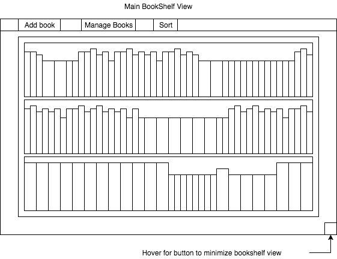

#VirtualBookshelf

## Background

Building off my Javascript project that  While animated a handful of preselected
books this project will build that seed idea into the full vision. The full scale app
will enable users to curate and display their own virtual bookshelf collections
via mobil, desktop, or home tv.

There are several book review and library management sites, GoodReads being
a primary example, however none of the available sites offer a way to virtually
recreate the bookshelf experience.

### MVP  

- [ ] have Users
- [ ] Users have books
- [ ] Pull a users read books via good reads api
- [ ] Pull cover art with the amazon api
- [ ] fully enable touch screen interaction
- [ ] Browse through books on the shelf the same way one would physically.
 Books are displayed by spine, not front cover, and as a user browses over
  them (mousing over, or swiping on touch screen) books are animated to allow
   the user to peak at the front and back covers.
- [ ] Utilize sorting algorithms for different modes of display
- [ ] Users can add their own photos
- [ ] Users can use others photos
- [ ] Users can select a book off the shelf and display book data

### Bonus features

- [ ] selected book can be opened in connected apps like kindle
- [ ] get on app store

### Wireframes

### Work done over the weekend

- Start react native tutorials
- research  

### Architecture and Technologies

This project will be implemented with the following technologies:

- React Native

### Timeline

**Day 1 Monday, 7/7 **:
- apply for Amazon & GoodReads api keys
- complete React Native tutorials

**Day 2 Tuesday, 7/8 **

- begin build out
- 

**Day 3 Wednesday, 7/9 **

**Day 4 Thursday, 7/10 **

**Day 5 Friday, 7/11 **

- main functionality complete
- start emulator / Demo page

**Day 6 Saturday, 7/12 **

- finish emulator & Demo Page

**Day 7 Sunday, 7/13 **

- last minute debugging & final run of polishing
- flex room in case of issues
